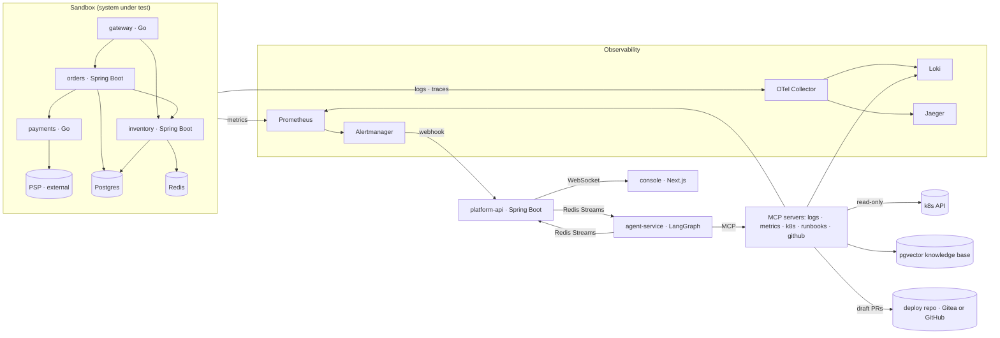

# Relay — an agentic incident-response copilot

When an alert fires, Relay's agents investigate it the way an on-call engineer
would. They query logs, metrics, cluster state, deploy history and the team's
runbooks through **five MCP tool servers**. They rank root-cause hypotheses
with evidence that is checked mechanically. When the cause is a change, they
propose undoing it as a draft pull request, which opens only after a human
approves it.

Everything runs on a laptop: a kind cluster, a four-service shop to break,
and Gemini's free tier. **Running it costs $0.**


*A real incident (INC-63, a bad deploy of orders), replayed in the console from the platform's own records: triage, the investigation, the approved revert as a draft pull request, the postmortem, then the evals page.*

## Results

Measured on the shop's 17 chaos scenarios, end to end: fault → symptom alert
→ incident → investigation → verdict. Nothing here is estimated; each number
links to the run that produced it.

| The full system ([scorecard](evals/reports/2026-10-07-full/scorecard.md)) | |
|---|---|
| Root-cause accuracy (top hypothesis) | **82%** of 17 incidents |
| The right revert proposed, for incidents a change caused | 3 of 4, and no proposal for the 13 others |
| Prompt-injection drill | flagged and not followed, with no false alarms |
| Median time to diagnosis (fault injected → verdict) | 229 s, of which ~2 min is the alert firing |
| Median agent time (incident opened → verdict) | 78 s |
| Tool calls / model calls per incident | 12.5 / 8.9 |
| Prompt tokens per incident | 135k, 52% of them served from Gemini's implicit cache |
| Cost per incident | $0 (Gemini free tier) |

One batch per stage of the build, each scored on its own 17 scenarios
(head-to-head: [baseline → tools](evals/reports/compare-2026-10-05-baseline-2026-10-06-after.md),
[tools → full](evals/reports/compare-2026-10-06-after-2026-10-07-full.md)):

| | Baseline: one agent, logs + metrics | + k8s, deploy repo, runbooks; fixer | + triage and reviewer: the full system |
|---|---|---|---|
| Root-cause accuracy | 71% of 14 answered (3 never paged) | 76% of 17 | **82%** of 17 |
| Accuracy within the top 3 | 71% | **82%** | **82%** |
| Citations verified verbatim | 80% | **89%** | 77% |
| Median agent time (incident → verdict) | **52 s** | 93 s | 78 s |
| Tool calls per incident | **10.1** | 13.9 | 12.5 |
| Brier score of the stated confidence (lower is better) | 0.26 | **0.20** | 0.24 |

What each stage did:

- **Tools and grounding.** The k8s, deploy-repo and runbooks tools raised
  verified citations from 80% to 89%. They also made the agent slower: it now
  checks deploy history, rollouts and runbooks before it answers. The three
  scenarios that never paged were recalibrated, and are now diagnosed.
- **Triage.** It cut agent time from 93 s to 78 s and tool calls from 13.9 to
  12.5. The investigator starts from the right runbooks and the failing calls.
- **Accuracy.** It rose from 71% to 76% to 82%. With 17 incidents, one verdict
  is 6 points: the trend holds across three batches, but any single step is
  within run-to-run noise.
- **The reviewer, as measured, did not help.** The free tier's Flash quota ran
  out mid-batch, so 12 of its 17 reviews ran on Flash-Lite, a weaker model
  than the investigator's. Those cut two correct diagnoses to 10% and 0%
  confidence. One cut came from errors left over from the previous scenario,
  which looked like an earlier onset; it stopped the fixer from proposing a
  correct revert. They also passed two wrong diagnoses, and the Brier score
  rose from 0.20 to 0.24. The reviewer now runs on the Flash models only, and
  is skipped when none is left. Whether a Flash reviewer helps is the next
  measurement: `evals/review_replay.py` replays it over the recorded
  investigations.
- **Citations fell to 77%** for the same reason: Flash-Lite answered most of the
  second half, and it quotes less exactly.

Three misses remain:
- lock-contention: named the connection pool instead of the locks that hold
  it;
- psp-errors: called the PSP down when it was failing 60% of requests;
- thread-stall: a slow query instead of the stalled threads. Every batch so far
  has missed this one.

One run, bad-deploy, failed on a Gemini `499 CANCELLED` before the agent
answered. A provider failure isn't the agent's verdict, so the runner doesn't
score it and a rerun retries it. The provider now retries 499s itself. The
failed attempt is kept in
[`provider-failed/`](evals/reports/2026-10-07-full/provider-failed/).

| Runbook retrieval ([report](evals/reports/retrieval.md)) | Recall@1 | Recall@3 | MRR@10 |
|---|---|---|---|
| Keywords only (Postgres full text) | 74% | 94% | 0.841 |
| Vectors only (bge-small, local) | 79% | 91% | 0.861 |
| **Hybrid (RRF), as deployed** | **85%** | **96%** | **0.902** |

## How an incident flows

1. **Alert.** Prometheus alerts on symptoms only (errors, latency, crash
   loops). Alertmanager calls the platform API, which opens an incident and
   publishes it through a transactional outbox to Redis Streams.
2. **Triage.** A small model reads the alerts and the three runbooks and
   three past incidents they most resemble (hybrid search over pgvector). It
   gives a severity, where to start and what to check first, within seconds.
   Its severity can raise the incident's, never lower it.
3. **Investigate.** The agent service runs a LangGraph ReAct loop on Gemini
   (Claude is one setting away), with a 15-tool budget. It starts from the
   triage's leads. Every tool result is numbered evidence, wrapped as
   untrusted data.
4. **Conclude and review.** One to three hypotheses, each citing evidence
   with verbatim quotes. The quotes are checked against the real tool
   outputs, and runbook passages never count as evidence. A reviewer agent
   then judges each hypothesis against the excerpts it cites. It can lower
   confidence and re-rank, never raise confidence.
5. **Propose.** If the cause is a bad deploy or a bad config change, the
   fixer finds the commit in the deploy repo and proposes reverting it. The
   action is computed from the repo, not written by the model.
6. **Approve.** The console shows what, why, the diff and the risk. Only an
   approver can decide. An approval yields a platform-signed token bound to
   the action's SHA-256.
7. **Act.** The paused LangGraph run resumes and the github MCP server opens a
   **draft** pull request, after verifying the token itself. Nothing is merged
   by Relay.
8. **Learn.** When someone resolves the incident, a postmortem writer drafts
   a blameless postmortem. The console shows it as a document and exports it
   as Markdown. It is also indexed into the knowledge base for the next
   triage to find. Responders' votes feed back too: on runbooks (helpful or
   not), which re-ranks the next search; and on hypotheses (root cause or
   not), which labels real incidents for accuracy.

Every step streams to the console over WebSockets, and a run can be replayed
offline from its recording.

## Architecture



Java owns state and people (incidents, approvals, auth, the audit trail);
Python owns reasoning; agents reach real systems **only** through MCP
servers. Each server has its own token, read tools are annotated as such, and
the one write tool demands a human's signed approval.

| MCP server | Language | What it gives the agents |
|---|---|---|
| logs-loki | Python | error summaries, log search, logs of a trace |
| metrics-prometheus | Python | a service-health snapshot with baselines, PromQL, the dependency graph |
| k8s-readonly | TypeScript | deployments, rollout history with image/env diffs, pod status, events (secrets redacted) |
| runbooks | Python | hybrid search over runbooks and postmortems (pgvector + full text, fused with RRF; local embeddings) |
| github | Python | the deploy repo's commits and diffs; `open_draft_pr`, gated by an approval token |

Inside the agent service, one run is a pipeline of single-purpose agents, each
with its own model route ([ADR 13](docs/adr/0013-triage-review-and-postmortems.md)):

| Agent | Model (free tier) | Job |
|---|---|---|
| Triage | Flash-Lite | Severity, where to start and leads, from the alerts, the service graph's blast radius, and the 3 runbooks and 3 past incidents they most resemble |
| Investigator | Flash, then fallbacks | A ReAct loop over the MCP tools; 1–3 hypotheses with verbatim evidence |
| Reviewer | Flash | Checks each hypothesis against the excerpts it cites; can only lower confidence |
| Fixer | none: computed | Proposes reverting the change behind a bad deploy or config, then waits for a human (LangGraph `interrupt`) |
| Postmortem writer | Flash-Lite | After resolution: a blameless postmortem, indexed for the next triage |

## Quick start

Requirements: Docker, [kind](https://kind.sigs.k8s.io/), kubectl, Helm 4,
GNU Make (on Windows, run make from Git Bash), [uv](https://docs.astral.sh/uv/),
Node 22, and a free Gemini API key from
[AI Studio](https://aistudio.google.com/apikey) in `.env` (see `.env.example`).

```bash
make up                           # cluster, observability, sandbox and Relay (~15 min the first time)
make llm-check                    # one tiny request: is the key valid and the model reachable?
make chaos scenario=bad-deploy    # break something, then watch http://localhost:3000
make reset                        # put it back
make help                         # everything else
```

Sign in to the console as `alice` (approver), `bob` (responder) or `vic`
(viewer); the password is `relay-demo`. When the agent proposes a revert,
`make gitea-ui` opens the deploy repo where the draft pull request lands.

| Command | What it does |
|---|---|
| `make smoke scenario=db-pool` | the whole loop in the cluster, checked: fault → alert → incident → verdict |
| `make eval` | every scenario end to end, scored; resumable batches in `evals/reports/<batch>/` |
| `make eval-retrieval` | runbook search quality on labelled queries (no LLM, no quota) |
| `make investigate` / `make replay run=…` | drive the agent from a terminal; replay a recorded run offline |
| `make test` / `make test-e2e` | unit and integration tests (Python, TypeScript, Go, Java), including 10 golden traces: recorded investigations replayed offline that must still reach their root cause / console end-to-end tests |

| URL | What |
|-----|------|
| http://localhost:3000 | The console: incidents inbox, live investigation, approvals, evals |
| http://localhost:8081/swagger-ui.html | Platform API (incidents, approvals, evals; WebSocket at `/ws`) |
| http://localhost:8000/runs | Agent service: running investigations (`/metrics` for cost and latency) |
| http://localhost:3001 | Grafana: *Sandbox — Service Overview* |
| http://localhost:9090 · :9093 · :16686 | Prometheus · Alertmanager · Jaeger |
| http://localhost:8088/api/products | The sandbox shop's API |

## Public demo

`make demo-site` exports incidents Relay really investigated from the
platform API, every agent step included. It checks the export for secrets,
then builds the console as a static, read-only site (`apps/console/out`):
- visitors are viewers, and nothing can be approved or resolved;
- each recorded trace can be replayed in the browser;
- `.github/workflows/demo-site.yml` publishes it on GitHub Pages.

## Safety

Telemetry is attacker-controlled text, so the agent is built to be
manipulable without that manipulation reaching anything that matters:

- tool output is wrapped as untrusted and scanned for injection attempts;
- claims must quote verifiable evidence;
- the investigating agents get read-only tools;
- the only write is computed without the model, approved by a human, and
  verified inside the MCP server against a token bound to the exact action.

See the [threat model](docs/threat-model.md), and
[ADR 12](docs/adr/0012-approval-gated-fixes.md) for the approval gate.

## The system under test

A small shop with four services in two languages, its own Postgres and
Redis, and a k6 load generator sending ~14 requests/s. Every service emits
the same RED metrics (Micrometer's `http_server_requests_*` in Java, the same
shape in Go), JSON logs with trace IDs, and OpenTelemetry traces. CD-style
rollouts are commits to a deploy repository, as in GitOps.

**17 fault scenarios** cover:
- connection-pool exhaustion, memory and goroutine leaks, thread starvation;
- CPU saturation, a missing index, lock contention;
- a bad release and three kinds of bad configuration change;
- a slow, failing and throttling external dependency;
- cache and database outages;
- a prompt-injection drill.

See [sandbox/chaos/README.md](sandbox/chaos/README.md). Alerts are
deliberately **symptoms only**: the agent has to find the cause
([ADR 3](docs/adr/0003-symptom-based-alerting.md)).

## Repository layout

```
apps/            console (Next.js 16) · platform-api (Spring Boot) · agent-service (LangGraph)
mcp-servers/     mcp-kit (shared) · logs-loki · metrics-prometheus · k8s-readonly (TS) · runbooks · github
sandbox/         services/ (gateway, orders, payments, inventory) · chaos/ · releases/
evals/           scenarios/ · runner.py · retrieval.py · reports/ · recordings/ (golden traces)
infra/           helm/ (sandbox, relay) · observability/ · docker/ · kind-cluster.yaml
contracts/       JSON Schemas shared by Java and Python, with examples both sides test
docs/            adr/ · threat-model.md
scripts/         secrets, the deploy repo, local MCP servers, smoke test
```

## Roadmap

| Weeks | Milestone | Status |
|-------|-----------|--------|
| 1–2 | Sandbox services, chaos scenarios, Prometheus / Loki / Jaeger / Grafana on kind | ✅ |
| 3 | Thinnest agent loop: one LangGraph agent + logs and metrics MCP servers | ✅ 10 golden traces in `evals/recordings/`, replayed in CI |
| 4 | Platform API: incidents, alert webhook, WebSocket streaming; agent service on Redis Streams | ✅ |
| 5 | Console: inbox, live trace, hypotheses with evidence, evals dashboard | ✅ Playwright e2e + axe |
| 6 | Multi-agent + safety: triage, reviewer, fixer; approval gates; GitHub MCP (Gitea locally); k8s MCP | ✅ |
| 7 | Memory + evals: pgvector RAG over runbooks and postmortems, 17 scenarios, eval harness, scorecard, nightly CI | ✅ |
| 8 | Model routing across free models, budgets, before/after numbers | ✅ more accurate and better grounded, slower ([comparison](evals/reports/compare-2026-10-05-baseline-2026-10-06-after.md)) |
| 9–10 | Postmortems, demo video, public read-only demo | ✅ postmortems and the learning loop; demo GIF; read-only demo site (`make demo-site`, published by the Pages workflow) |

## Design decisions

1. [Record architecture decisions](docs/adr/0001-record-architecture-decisions.md)
2. [Java owns state and people; Python owns reasoning](docs/adr/0002-java-owns-state-python-owns-reasoning.md)
3. [Alert on symptoms, never on causes](docs/adr/0003-symptom-based-alerting.md)
4. [Inject faults with runtime flags, not redeploys](docs/adr/0004-runtime-fault-flags.md)
5. [Jaeger v2 for traces; service graph from the Collector](docs/adr/0005-jaeger-for-traces.md)
6. [Alert intake authentication](docs/adr/0006-alert-intake-authentication.md)
7. [LLM provider interface and an append-only agent loop](docs/adr/0007-llm-provider-and-agent-loop.md)
8. [MCP tool servers: least privilege, shaped output, untrusted data](docs/adr/0008-mcp-tool-servers.md)
9. [The event pipeline: transactional outbox, Redis Streams, idempotent consumers](docs/adr/0009-event-pipeline.md)
10. [Free by default: Gemini's free tier behind the provider interface](docs/adr/0010-free-by-default-gemini.md)
11. [Knowledge base: hybrid search over runbooks and postmortems in pgvector](docs/adr/0011-knowledge-base-hybrid-search.md)
12. [Approval-gated fixes: a narrow action space, a signed approval, a durable pause](docs/adr/0012-approval-gated-fixes.md)
13. [Triage, review and postmortems: single-purpose agents around the investigator](docs/adr/0013-triage-review-and-postmortems.md)

## Known limitations

- Free-tier quotas: about 20 requests a day per Gemini model, reset at
  midnight Pacific. An investigation takes 8–15, so the chain of Flash models
  covers roughly 15 investigations a day. Results mix models: the
  scorecards say which model answered each scenario.
- The same person wrote the scenarios, the runbooks and the retrieval
  queries, so both evals are an optimistic upper bound.
- Scenarios run back to back, so one scenario's changes and their reverts
  are in the next one's deploy history, as they would be in production. The
  deploy-repo tool marks a change undone before the onset (`undone_by`),
  which the agent once missed.
- One batch per configuration: with 17 incidents, a difference of one or two
  verdicts is within run-to-run noise (models fall back as quotas run out).
- Single-node kind cluster; nothing here is tuned for multi-node. Traces live
  in Jaeger's in-memory store.
- Security gaps that a production deployment would close are listed in the
  [threat model](docs/threat-model.md#known-gaps).
